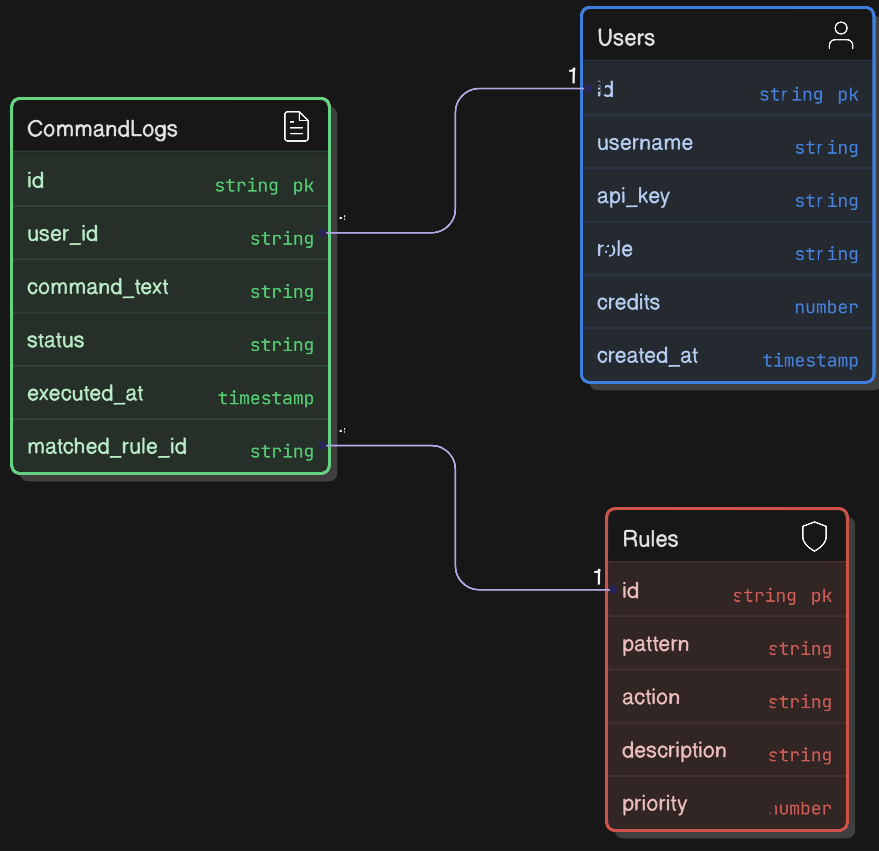

# Tether

A secure Command Gateway API designed to manage, audit, and monetize remote shell command execution through a credit-based economy and regex-based firewall.

**Hosted Backend URL:** [https://unbound-backend-jseh.onrender.com](https://unbound-backend-jseh.onrender.com)

## Installation & Local Setup

1. **Install Dependencies**
   ```bash
   npm install
   ```

2. **Environment Configuration**
   Create a `.env` file in the root directory based on the provided example:
   ```bash
   cp .env.example .env
   ```
   Fill in your MongoDB URI and other variables in `.env`.

3. **Run Development Server**
   ```bash
   npm run dev
   ```
   The server will start on `http://localhost:3000`.

---

## Command Gateway API Documentation

## Database Schema


## Authentication
All requests must include the API Key in the headers to identify the user and their role.

- **Header:** `X-API-KEY: <your-api-key>`

---

## 1. Core Execution (Member & Admin)
These are the primary routes used by the CLI/Frontend to run commands.

| Route | Method | Description | Request Body | Response Example |
| :--- | :--- | :--- | :--- | :--- |
| `/api/commands` | `POST` | **Submit a Command.** <br>1. Checks user credits.<br>2. Matches against Rules.<br>3. Mocks execution if accepted.<br>4. Deducts credits. | `{ "command": "ls -la" }` | `{ "status": "EXECUTED", "output": "...", "credits_remaining": 99 }` |
| `/api/commands/history` | `GET` | Get the logged-in user's personal audit log (command history). | N/A | `[{ "command": "ls", "status": "EXECUTED", "timestamp": "..." }]` |
| `/api/profile` | `GET` | Get current user details and credit balance. | N/A | `{ "username": "alice", "credits": 50, "role": "MEMBER" }` |

---

## 2. Rule Configuration (Admin Only)
Endpoints to manage the firewall rules (regex patterns).

| Route | Method | Description | Request Body | Response Example |
| :--- | :--- | :--- | :--- | :--- |
| `/api/rules` | `GET` | List all active rules (patterns and actions). | N/A | `[{ "id": 1, "pattern": "^rm -rf", "action": "AUTO_REJECT" }]` |
| `/api/rules` | `POST` | Create a new rule. **Validates Regex syntax.** | `{ "pattern": "^git push", "action": "AUTO_ACCEPT", "description": "Allow git push" }` | `{ "id": 2, "message": "Rule created" }` |
| `/api/rules/{id}` | `DELETE` | Remove a rule by ID. | N/A | `{ "message": "Rule deleted" }` |

---

## 3. Command Approval (Admin Only)
Endpoints for admins to manage commands that are pending approval.

| Route | Method | Description | Request Body | Response Example |
| :--- | :--- | :--- | :--- | :--- |
| `/api/admin/pending-commands` | `GET` | List all commands awaiting admin approval. | N/A | `[{ "id": "cmd_123", "user": "charlie", "command": "sudo apt update", "requested_at": "..." }]` |
| `/api/admin/pending-commands/{id}` | `POST` | Approve or reject a pending command. | `{ "action": "APPROVE" }` or `{ "action": "REJECT" }` | `{ "message": "Command approved", "status": "EXECUTED" }` |

---

## 4. User Management (Admin Only)
Endpoints to onboard users and manage the credit economy.

| Route | Method | Description | Request Body | Response Example |
| :--- | :--- | :--- | :--- | :--- |
| `/api/users` | `GET` | List all users and their current balances. | N/A | `[{ "username": "bob", "credits": 10 }]` |
| `/api/users` | `POST` | Create a new user. Returns API Key **once**. | `{ "username": "bob", "role": "MEMBER" }` | `{ "username": "bob", "api_key": "sk_12345" }` |
| `/api/users/{id}/credits`| `POST` | Add/Reset credits for a user. | `{ "amount": 100 }` | `{ "new_balance": 110 }` |

---

## 5. Audit & Monitoring (Admin Only)
Endpoints for the admin dashboard to view system activity.

| Route | Method | Description | Request Body | Response Example |
| :--- | :--- | :--- | :--- | :--- |
| `/api/admin/audit-logs` | `GET` | View global execution logs. Supports filtering. | Query: `?status=REJECTED` | `[{ "user": "bob", "cmd": "rm /", "status": "REJECTED" }]` |
| `/api/admin/stats` | `GET` | System overview stats (total runs, total rejections). | N/A | `{ "total_commands": 500, "rejected": 12 }` |

---

## 6. Notifications (Member)
Endpoints for users to receive updates on their command status (e.g., when an admin approves a pending command).

| Route | Method | Description | Request Body | Response Example |
| :--- | :--- | :--- | :--- | :--- |
| `/api/commands/notifications` | `GET` | Get all notifications for the current user. | N/A | `[{ "_id": "notif_123", "type": "COMMAND_APPROVED", "message": "Your command has been approved.", "timestamp": "..." }]` |